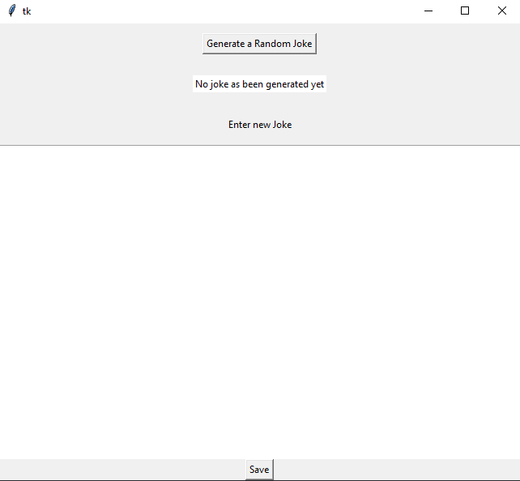

# Python Desktop app Developement: Old School or Useful

Computers without software are almost useless, especially for ordinary users. While the main software (O.S) is needed to do the heavy-lifting, including controlling how other software and hardware behave, a computer needs a list of software to operate and many other applications for a good user experience. In this article, we will discuss the advantages of making desktop applications and a look at Python GUI programming while answering the questions below.

-	What are some of the benefits of making GUIs?
-	Should I make a web app or a desktop app for my project?
-	When I decide to make desktop apps with Python, what do I need to know to be well equipped.?

Let's face it, codes are ugly! As developers, we can only try to make our code a bit beautiful and readable. But codes are still considered as something supernatural to non-developers. It can be intimidating even to developers when looking at code written in an unfamiliar language. That being said, it is a good idea to make a user interface for our programs.

## What are some benefits of GUIs?

In marketing, images have the reputation of catching people's attention and encouraging them to take action. Well-designed graphics can even do more, they can give clear and very explicit details about the data or the expected action that the user need to take. This, in turn, makes the interface appealing and smoothes the interaction with your computer or the Internet. It also adds a sense of accomplishment for the developer.

We all have been there. After designing a program, we are enthusiastic and want to share it with friends or family. But wait a minute. Grandpa does not understand programming languages. Peter, my friend, is a Java developer and does not have python installed on his computer. What do I do? Forcing others to learn how to code and install Python on any other device? Of course not.

Python, like most programming languages, has solutions to challenges, such as web apps, desktop apps, mobile apps, etc. That allows us to make programs with GUIs that can be shared easily via social media or other means of transferring data and can be tested without the need to install all the dependencies required in the development process. This means we cannot make excuses when it comes to making proper UIs. In this article, we will focus on the Python language and its GUI frameworks

## Should I make a web app or a desktop app for my project?

There is no doubt that web apps are better than desktop apps in many ways. They outperform desktop apps in sales, flexibility, innovation, customization, accessibility, update, etc, etc. However, they fall short when it comes to security and data privacy. There are other reasons why we might have to use or make desktop apps.

While it is possible to make a web app calculator, would you not rather prefer a local calculator on your device than surf the net just to get a sum? Do you really need to open a browser to sort out your files in that USB? We do appreciate google docs, but that is nothing compared to excel. Besides their physicality and convenience, some functionalities on desktop apps are internet free. That makes desktop apps the first choice, especially in areas where the internet is expensive or not reliable.

From a developer viewpoint, we all don't have to convert to web development or graphic design to be able to make some graphics that allow users to interact with our programs. Many programming languages, like Python, have come up with some good solutions to this problem that sometimes doesn't need extra settings or installations.

To get started with web apps development in python, you need to learn a list of web concepts and a few languages like CSS and HTML. However, making a quick graphical interface for your program that can be executed on your computer may be more convenient than you thought.
To give you a taste of what you can expect, run from your Python Shell or IDE.
```python
import TKinter as tk

tk._test()
```
This checks if Tkinter is installed. Since TKinter generally comes pre-installed with python. You should get a GUI displayed depending on your operating system.

If you run into trouble you might want to [manually install Tkinter](https://www.tutorialspoint.com/how-to-install-tkinter-in-python).

Note: The code above and the rest of the example codes in this tutorial should run if Python was installed with the official installer for Widows or macOs.


## When I decide to make GUI apps with python, what do I need to know to be well equipped?

Python is still one of the 5 best programming languages for desktop apps. So we are not going in the wrong direction. In fact, the python IDLE itself was built with python using the very same library we just tried now (Tkinter). If you are already comfortable with Python, you could jump right into Tkinter and start building some GUI.


However, there is no easy way to become a desktop app developer. 
The truth is that web apps are fairly complex to make than desktop apps. Think about it, you need to learn at least three different coding languages for your style, markup, and query language on top of the framework language. Then you have to worry about how to roll it out, where to get the domain name, who will host your site, etc., etc. 

With desktop app development in Python, guess how many programming languages you need to learn? You might be expected to be familiar with some CSS or styling standards. But that is not a hard requirement. Does that mean that this is going to be an easy journey?

Python desktop app developers are expected to have a solid understanding of;

### Python

This shouldn't be a surprise. If we are to develop stuff with Python we need to be familiar, or be comfortable with the language. If you have no knowledge of the language, you can start by learning the Python programming language. Python is one the easiest and most elegant programming languages to learn, and you can even find volunteer mentors for free like [@pyTony](https://py-tony.netlify.app/mentor#gsc.tab=0).

### Object orientated programming (OOP) 

There is a concept called DRY in programming, and OOP helps you to achieve just that. Besides, saving you from repeating codes and logic in your program OOP also makes your code look more clean and maintainable.

### Libraries

Like the literal meaning suggests (a room containing a collection of books), programming libraries aim to facilitate some configurations and comes with prewritten codes to help us achieve specific tasks. There are several libraries in Python to accomplish different tasks. When it comes to GUIs, we still have some decisions to make about which library will suit a given project or our programming style. Having the ability to use them effectively and understand when and why to do so is a skill we shouldn't overlook.

### Frameworks

Frameworks speed the development process. They provide blueprints and solutions that are tailored for a given task. A framework can be thought of as a workplace where things are structured and things must be done according to a certain method. While the words library and framework are often used interchangeably in programming, they are different. Understanding their differences will empower us to know when and why to use them.

As a bonus, we're going to have a quick look at the two of the most popular Frameworks in Python.

## Tkinter Vs Pyqt5

Of course, there are many frameworks to build GUIs in python, Tkinter and Pyqt are just two of the most popular we can find out there. While these tools have one goal in common which is helping you build GUIS, they differ in style and approaches.

### Tkinter

Think of Tkinter more like a library than a framework because it allows you to write GUIs yourself, program your settings or functionality in the same script. It offers more learning opportunities and is easy to control. It is also not strict on OOP and MVC(model, view, control) programming style which makes it suitable for simple tasks. Check out this article by Prachi Prakash for a Guide to Standard GUI library in Python with TKinter.

### Pyqt5

Think of Pyqt as a Framework because there are standards that you need to follow. You might have to separate your GUI script separately from your python script (where you’re writing your logic of the application). Your GUI script is generally generated automatically by another tool called QT designer. You are expected to have a stable knowledge of OOP and be Familiar with MVC. Pyqt5 is also only supported in Python v3.5 and later.

## Demo

In this demo we will learn how to create a simple but functional GUI.
We are going to create a program called joke generator that will look roughly like this;

<div align="center">
     
</div>


To accomplish this we’re going to need to create a main window, add some widgets to it, and some functions that will make the GUI interactive. 
Note: this is not a tutorial on how to build GUI but a demo as an introduction to GUI.

First we’re going to import the needed tool tkinter the library for our GUI and random that will allow us to generate random jokes.
```python
import tkinter as tk
import random 
```
Next we’re going to make sure that the file that will store jokes exists and contains some default jokes.
```python
#opening file in w+ mode will open the file if it exists, otherwise it will create it
with open("jokes.txt","w+") as f:
    joke = f.read()

    # check if the list is empty
    #if so write some default jokes to the file
    if len(joke) == 0:
        f.write("this is not funny \nseriously try it \nI don't know but it working \n")
```
here we’re create two functions one for the button to generate the joke randomly and the other for the button to save new jokes.
```python
def joke_generator():
    """generate random jokes from the file jokes.txt and display the text to the label lbl_display_joke"""
    #we open the file and read it contents
    #read the file using the .readlines() function so that it return data in form of a list
    with open("jokes.txt", "r+") as f:
        jokes = f.readlines()
        #using the .choice() function of the random module to pick a random item(joke) 
        #and update the text on the label that displays jokes.
        lbl_display_joke.config( text = random.choice(jokes))
```
Define a function called save_joke() that will help to get joke that the user enter in the text box and save it to the file
```python
def save_joke():
    """get text from the txt box txt_joke and save new joke to the file jokes"""
    #open the file and read it content using the .read() function so that it return data in form of a string
    with open("jokes.txt", "r+") as f:
        jokes = f.read()
        #check if the text box contain any text
        #get the txt entered in the txt box and write the text to the file
        new_joke = txt_joke.get(1.0, tk.END)
        f.write(new_joke)

        #clear the text box
        txt_joke.delete('1.0', tk.END)
```
Next we're going to create the GUI itself. starting by coding the main window seting up some basic geometry
```python
#create the main window
window = tk.Tk()

#setup some basic geometry for our window
window.rowconfigure([0, 1, 2, 3], minsize=50, weight=10)
window.columnconfigure(0, minsize=50, weight=1)
```
Then, we're going to add the necessary widgets to the main window
```python


#create and add a button to the main window to generate new jokes when pressed
btn_generate = tk.Button(master=window, text="Generate a Random Joke", command=joke_generator)
btn_generate.grid(row=0, column=0)

#create and add a label to the main window to display the jokes
lbl_display_joke = tk.Label(master=window, text="No joke as been generated yet", bg="white")
lbl_display_joke.grid(row=1, column=0)

#create and add a label to the main window on top of the text field
lbl_add_joke = tk.Label(master=window, text="Enter new Joke")
lbl_add_joke.grid(row=2, column=0)

#create and add a text bot to the main window that will serve as entry field for new jokes
txt_joke = tk.Text(master=window) 
txt_joke.grid(row=3, column=0)

#create and add the button to the main window for saving input
btn_save = tk.Button(master=window, text="Save", command=save_joke)
btn_save.grid(row=4, column=0)
```
finally we're going to run the GUI by calling the .mainloop() function on the window to ru an infinite loop that allow the application run, wait for an event to occur and process the event as long as the window is not closed.
```python
#run the main loop
window.mainloop()
```
`Output`

<div align="center">
     
</div>


For your reference, [get the source code here](https://github.com/py-tony/Python-Desktop-app-Development-Old-school-or-Useful-/blob/9e1e5abc7895e6eb62a7683d85bccf9354a04392/demo.py) that includes instructions on how to make it an excutable file. 

## Conclusion

The Python programming language has proven to be useful in a range of ways. Its elegance and simplicity, which emphasize natural language, makes it a good choice even for newcomers to programming. As we saw in this article, the language has potential use in developing desktop apps. We also highlighted the advantages of making desktop apps and use-cases compared to web apps. We did not intend to discourage the use or development of web applications. We strongly believe that web apps play a vital role in the world of software because of their flexibility and accessibility. In the article, the author aimed to encourage or empower developers to create GUIs without needing to switch to another form of development or having to think about studying graphic design.

